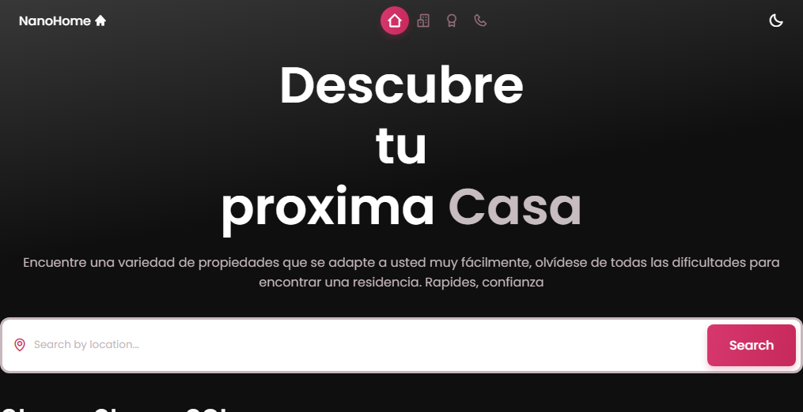
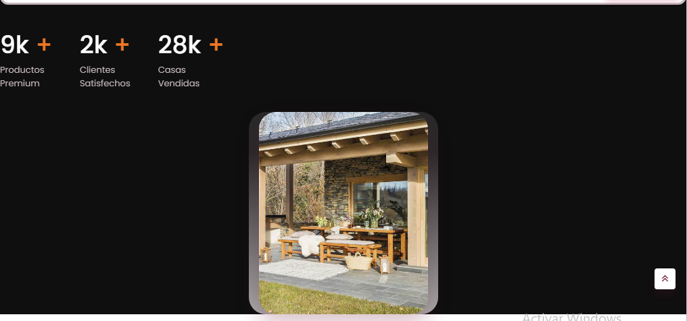
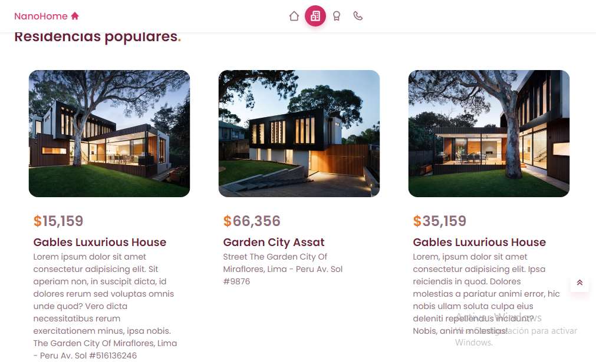
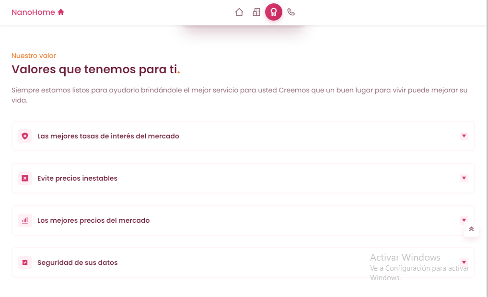
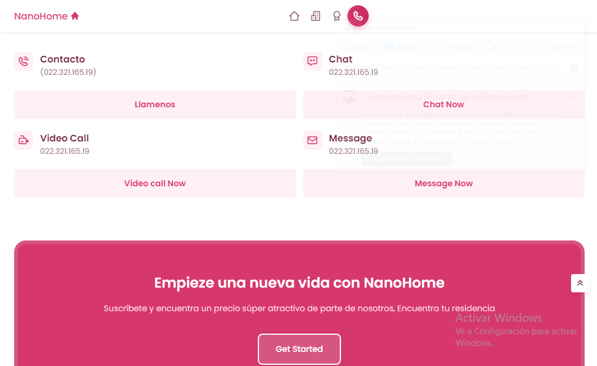

<h1 align="center"> Nano-Home </h1>

   

   
   

Deploy: <a href='https://nanomarquez.github.io/Responsive-web-Nanohome/'>Here</a>

## Details

- `Responsive Real State Website Using HTML CSS & JavaScript`
- `Contains animations when scrolling.`
- `Includes a dark and light mode.`
- `Smooth scrolling in each section.`
- `Developed first with the Mobile First methodology, then for desktop.`
- `Compatible with all mobile devices and with a beautiful and pleasant user interface.`

<h2 align="center"> Preview mobile version </h2>

<h2 align="center"> Previews desktops version </h2>
<h3 align="center"> Home </h3>

<h3 align="center"> Rates </h3>

<h3 align="center"> Mejores opciones </h3>

<h3 align="center"> Nuestro valor </h3>

<h3 align="center"> Contactenos </h3>

